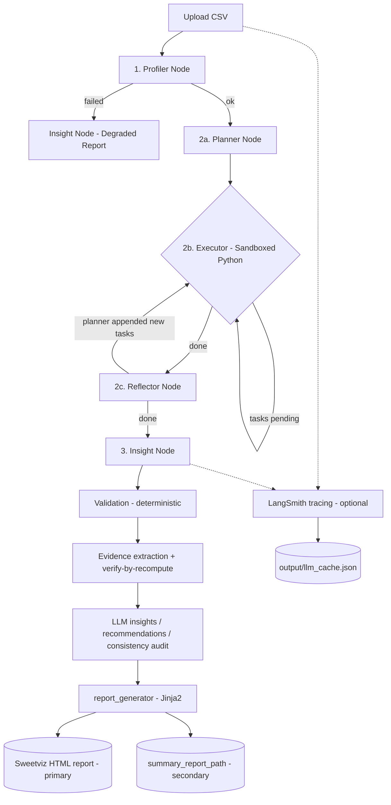

# 🤖 AI Data Analyst — Multi-Agent Pipeline

> **Live Demo:** <https://analysis.akashg.me/>

An autonomous **multi-agent data analysis platform** that turns a raw CSV into a
validated, executive-ready deliverable. Built with **LangGraph** (orchestration),
**FastAPI** (REST API), **TanStack Start / React** (dashboard), **sweetviz**
(interactive EDA report), and deterministic LLM verified evidence.

Given a CSV upload, the system:

1. **Profiles** the data (pandas statistics + Sweetviz interactive report).
2. **Plans & executes** sandboxed Python to compute stats and plot charts.
3. **Verifies** every number before the LLM is allowed to use it.
4. **Writes** insights, recommendations, and a report-grounded chatbot answer.
5. **Delivers** the Sweetviz HTML report as the primary shareable/downloadable artifact.

> **Report policy:** the primary HTML deliverable is the interactive **Sweetviz
> profile report** (rich, self-contained, offline-friendly). PDF export is
> disabled by default and can be re-enabled via `ENABLE_PDF=1`.

---

## 🧭 Table of Contents

- [Demo](#-demo)
- [Key Features](#-key-features)
- [System Architecture & Workflow](#-system-architecture--workflow)
- [Two Frontends](#-two-frontends)
- [Member Contributions](#-member-contributions--who-built-what)
- [Shared State Architecture](#-shared-state-architecture)
- [Project Structure](#-project-structure)
- [Prerequisites](#-prerequisites)
- [Installation & Setup](#-installation--setup)
- [Environment Variables](#-environment-variables)
- [Running the Application](#-running-the-application)
- [Deployment](#-deployment)
- [API Reference](#-api-reference)
- [Tests](#-tests)
- [Reports & Outputs](#-reports--outputs)
- [Reliability & Graceful Degradation](#-reliability--graceful-degradation)
- [Recent Improvements](#-recent-improvements)
- [Known Limitations](#-known-limitations)
- [Roadmap](#-roadmap)

---

## 🌐 Demo

| Target | URL |
|---|---|
| **React Dashboard (TanStack)** | <https://analysis.akashg.me/> |
| API health + config | `GET https://<api-host>/health`, `GET /config` |
| OpenAPI docs | `GET /docs` |

The demo frontend talks to the FastAPI backend exposed via **Azure Container Apps**;
upload any CSV (e.g. `data/sample_sales.csv`) to run the full pipeline and
download the generated report.

---

## ✨ Key Features

- **Multi-Agent Orchestration.** State-driven `StateGraph` (LangGraph) wiring
  Profiler → Analysis → Insight with conditional re-routing.
- **LLM Resilient Fallback.** Primary OpenAI-compatible provider with automatic
  **Groq → Gemini** failover (`ResilientFallbackModel`) on 4xx/429/rate limits,
  plus centralized usage logging, budget caps, and pacing in `llm.py`.
- **Deterministic Evidence Verification.** A pre-LLM validation engine checks
  bounds, rates, cardinalities, and column existence; every insight is
  **verify-by-recompute** gated against the raw CSV with configurable tolerance
  before it reaches the report.
- **Sandboxed Python Execution.** Generated analysis code runs in an isolated
  subprocess with POSIX resource limits (`RLIMIT_CPU`, `RLIMIT_AS`, wall-clock
  timeout) and an **AST-based security gate** blocking `os`, `subprocess`,
  `shutil`, `ctypes`, `socket`, `eval/exec/__import__`, and `os.environ` access.
- **Interactive EDA Report.** Trusted **Sweetviz** auto-generated profile is the
  primary HTML deliverable — self-contained, works offline, no PDF dependency.
- **Report-Grounded Chatbot.** Anti-hallucination Q&A strictly constrained to
  verified pipeline output; graceful LLM-offline fallback answers.
- **Observability.** Optional **LangSmith** tracing tags every run/node; an
  `output/llm_cache.json` response cache (TTL + FIFO cap) cuts repeat LLM spend.
- **Production REST API + Two UIs.** FastAPI backend, a modern TanStack/React
  dashboard, and a 5-tab Streamlit app.
- **Pure-Pandas Fallback.** When an LLM is unavailable, profiling/analysis
  degrade gracefully to fully deterministic pandas output — no API key required
  for the core pipeline.

---

## 📐 System Architecture & Workflow



### Pipeline run (as defined in `graph.py`)

```
START
  └─► profiler ────────────── router ──► planner ──► executor ──(self-loop while pending)──► reflector
        │                         │                                               │
        └─ status == failed ──────┘                                              └── executor (new tasks)  /
                                                     (all done)                    → insight → END
```

- `profiler` (**M1**) — reads the CSV (UTF-8 → latin-1 fallback), validates shape,
  runs the Sweetviz profiling tool, and builds a structured `profile` dict.
- `planner` (**M2**) — decomposes the dataset into a task plan.
- `executor` (**M2**) — runs generated Python in the sandbox, captures
  stdout/stderr + chart files; self-loops while tasks remain pending.
- `reflector` (**M2**) — assesses completeness, may append tasks.
- `insight` (**M3**) — validates results, extracts verified evidence, writes
  LLM insights/recommendations, runs a self-consistency audit, and compiles the
  reports.

All nodes mutate and return the shared `AgentState` dict, so no node sees stale
or partial data from another.

---

## 🖥️ Two Frontends

| Frontend | Stack | Command | Notes |
|---|---|---|---|
| **Web Dashboard** | TanStack Start / React 19, TypeScript, Tailwind | `cd frontend && npm run dev` | Primary UI (deployed at the demo link) |
| **Streamlit App** | Streamlit 5-tab dashboard | `streamlit run app.py` | Pipeline runner, EDA, insights, chat, diagnostics |

The React app (front of `/report/{filename}`) renders the Sweetviz profile report
in an embedded iframe on the Profile tab and provides the HTML + PDF Report
download buttons.

---

## 👥 Member Contributions — Who Built What

The system was developed by a team of three members, each owning one agent in
the pipeline, coordinated through the shared `AgentState` contract
(`state/graph_state.py`).

### Member 1 — Profiler Agent (EDA & Data Profiling)

- CSV ingestion with encoding fallback (`utf-8` → `latin-1`) and shape validation.
- **Sweetviz** integration (`tools/profiling_tool.py`) producing the interactive
  profile report that is now the primary HTML deliverable.
- Structured dataset profile (`ProfileOutput` schema) — rows, columns, column
  metadata, numeric/categorical/datetime classification, descriptive statistics.
- **Pure-Pandas fallback** profiler for zero-LLM, deterministic operation
  (`LLM_PROFILER` opt-in for the LLM classification pass).
- Profiling tunables centralized in `config.py`:
  `PROFILE_MAX_FILE_SIZE_MB`, `PROFILE_PAIRWISE_COL_LIMIT`.
- Tests: `tests/profiler/test_profiler.py`, profiler fixtures + edge cases.

**Key code:** `agents/profiler/agent.py`, `agents/profiler/schemas.py`,
`agents/profiler/prompts.py`, `tools/profiling_tool.py`.

### Member 2 — Analysis Agent (Planner → Executor → Reflector)

- Task-based analysis planning (`planner_node`) decomposing the profile into
  concrete analysis tasks.
- **Sandboxed code execution** (`tools/python_executor.py`):
  - POSIX resource limits (`RLIMIT_CPU`, `RLIMIT_AS`, `EXECUTION_TIMEOUT`).
  - **AST security gate** (`SecurityError`) blocking dangerous builtins/modules
    and `os.environ` reads; sandbox violations surface as safe error dicts.
  - Captures stdout, stderr, generated image files, and a `RESULT_JSON` protocol
    that feeds Member 3's verification.
- **Reflector** QA loop that evaluates each task and can append follow-up tasks.
- Parallel task execution and retry with exponential backoff for rate limits.
- Execution tunables: `EXECUTION_TIMEOUT`, `EXEC_CPU_LIMIT_S`, `EXEC_MEM_LIMIT_MB`.
- Tests: `tests/analysis/test_analysis.py`, `tests/tools/test_sandbox_security.py`
  (27 tests).

**Key code:** `agents/analysis/agent.py` (`planner_node`, `executor_node`,
`reflector_node`), `agents/analysis/prompts.py`, `agents/analysis/schemas.py`,
`agents/analysis/templates.py`, `tools/python_executor.py`.

### Member 3 — Insight & Report Agent (Verification, Insights, Deliverables)

- **Deterministic validation engine** (`agents/insight/validation.py`) checking
  bounds, percentages, correlation ranges, rates, cardinalities, and column
  existence — no LLM involved for the math.
- **Evidence extraction** that only lets verified numbers reach the LLM.
- **Verify-by-recompute gate** (`agents/insight/verify.py`) — the final numbers
  are recomputed from the CSV and must match within
  `RECOMPUTE_TOLERANCE`/`RECOMPUTE_ABS_TOLERANCE`, else the insight is rejected.
- **LLM insight/recommendation generation** with an LLM self-consistency audit
  (`prompts.py`), including dedupe-by-metric and evidence-membership gates.
- **Report compiler** (`agents/insight/report_generator.py`): Jinja2 HTML +
  optional WeasyPrint PDF; base64-embedded charts; graceful degradation on any
  failure (`report_status` = `ok` | `degraded` | `failed`; `pdf_status` bit is
  `skipped` when PDF is disabled).
- **Report-grounded chat** (`agents/insight/chat.py`, `api/main.py /chat`)
  constrained to verified context with offline fallback.
- PDF policy: disabled by default — the Sweetviz profile report is the primary
  HTML deliverable.
- Tests: `tests/insight/*` (fixtures, validation, verify, report generator,
  insight node, chat) — **16 tests**, fully offline via `FakeChatModel`.

**Key code:** `agents/insight/insight_node.py`, `agents/insight/validation.py`,
`agents/insight/verify.py`, `agents/insight/prompts.py`,
`agents/insight/report_generator.py`, `agents/insight/chat.py`.

### Shared / Integration Work

- `graph.py` — LangGraph `StateGraph` composition + conditional routing.
- `state/graph_state.py` — single source of truth `AgentState` (TypedDict +
  validating Pydantic `StateContract`).
- `llm.py` — centralized model factory with provider failover, usage/budget
  tracking, response cache, and LangSmith tracing metadata.
- `config.py` — paths + tunables, `ensure_dirs()`, `snapshot()`.
- `api/main.py` — FastAPI routes (`/health`, `/analyze`, `/report/{filename}`,
  `/config`, `/chat`), CORS allowlist, bearer-token auth, static frontend mount.
- Integration tests: `tests/pipeline/test_graph.py`, `tests/llm/test_llm.py`.

---

## 🔗 Shared State Architecture (`AgentState`)

Every agent reads and writes the **same** state object — the contract is
defined once in `state/graph_state.py` (re-exported via `state.py` and
`agents/state.py`) and validated by the Pydantic `StateContract` model.

| Agent | Keys Written |
|---|---|
| **Profiler (M1)** | `csv_path`, `profile`, `profile_report_path`, `status` |
| **Analysis (M2)** | `analysis_plan`, `analysis_results`, `generated_files`, `execution_log`, `reflection_notes` |
| **Insight (M3)** | `validation_report`, `insights`, `recommendations`, `report_path`, `summary_report_path`, `report_status`, `pdf_path`/`pdf_status` |
| **Shared** | `error_log`, `thinking_log`, `llm_calls`, `status` |

---

## 📁 Project Structure

```
data_analyst_agent/
├── agents/
│   ├── profiler/            # M1 Profiler agent (agent.py, schemas.py, prompts.py)
│   ├── analysis/            # M2 Analysis agent (planner/executor/reflector)
│   ├── insight/             # M3 Insight & Report agent
│   │   ├── validation.py    # Deterministic verification engine
│   │   ├── verify.py        # Verify-by-recompute gate
│   │   ├── report_generator.py  # HTML (+ optional PDF) compiler
│   │   ├── chat.py          # Report-grounded chatbot
│   │   └── templates/       # Jinja2 HTML template
│   └── state.py             # Re-export of the shared state contract
├── api/
│   └── main.py              # FastAPI routes & security
├── state/
│   └── graph_state.py       # AgentState + StateContract (single source of truth)
├── tools/
│   ├── profiling_tool.py    # Sweetviz LangChain BaseTool
│   └── python_executor.py   # Sandboxed subprocess execution + AST security gate
├── frontend/                # TanStack Start / React 19 dashboard
│   ├── src/pages/           # Launcher, Profile, Insights, Chat, Diagnostics
│   └── src/services/api.ts  # API client + report download helpers
├── ui/                      # Streamlit 5-tab dashboard components
├── tests/                   # 116 tests (profiler, analysis, insight, llm, pipeline, ui, sandbox)
├── data/                    # Sample CSVs (sample_sales.csv, sample_hiring.csv, sample_churn.csv)
├── output/                  # Generated artifacts (profiles/, reports/, analysis/, llm_cache.json)
├── uploads/                 # Temporary upload directory
├── config.py                # Centralized paths + tunables + ensure_dirs()
├── graph.py                 # LangGraph pipeline composition
├── llm.py                   # Model factory, failover, budget, cache, tracing
├── app.py                   # Streamlit entry
├── Dockerfile               # Backend container (Azure Container Apps)
├── requirements.txt
└── .github/workflows/       # deploy-backend.yml (Azure), lint.yml (Ruff)
```

---

## ✅ Prerequisites

- Python 3.10+ (tested on 3.11/3.12/3.14)
- Node.js 18+ **or** Bun (frontend; `npm` is preconfigured via `package-lock.json`)
- API key for **at least one** provider: OpenAI-compatible, Groq, or Gemini
  (the core profiling/analysis path also runs fully offline with pandas).
- Optional (only if you re-enable PDF with `ENABLE_PDF=1`): WeasyPrint native
  libs — `libpango`, `libpangocairo`, `libcairo`, `libgdk-pixbuf` (installed in
  the Dockerfile already).

---

## 🚀 Installation & Setup

### Backend

```bash
# 1. Create + activate a venv
python3 -m venv venv
source venv/bin/activate          # Windows: venv\Scripts\activate

# 2. Install dependencies
pip install -r requirements.txt

# 3. Configure keys
cp .env.example .env              # then fill in your API keys
```

### Frontend

```bash
cd frontend
npm install                       # or: bun install
npm run dev                       # dev server -> http://localhost:5173
```

---

## 🔑 Environment Variables

Copy `.env.example` → `.env`. Highlights:

| Variable | Default | Purpose |
|---|---|---|
| `OPENAI_API_KEY` / `OPENAI_BASE_URL` | — | Primary OpenAI-compatible provider (GitHub/NVIDIA/other) |
| `GROQ_API_KEY`, `GEMINI_API_KEY` | — | Automatic fallbacks on primary failure |
| `MODEL` | `nvidia/nemotron-mini-4b-instruct` | Default model name |
| `LLM_PROFILER` / `LLM_PLANNER` / `LLM_REFLECTOR` | unset | Opt deterministic steps back into the LLM |
| `LLM_BUDGET_US`, `LLM_MIN_INTERVAL_S` | `1.0` / `1.0` | Spend cap + pacing |
| `LLM_CACHE_ENABLED`, `LLM_CACHE_CAP`, `LLM_CACHE_TTL_S` | off / 512 / 7d | Response cache |
| `EXECUTION_TIMEOUT`, `EXEC_CPU_LIMIT_S`, `EXEC_MEM_LIMIT_MB` | 30 / 30 / 1536 | Sandbox limits |
| `RECOMPUTE_TOLERANCE`, `RECOMPUTE_ABS_TOLERANCE` | `0.03` / `1e-4` | Verify-by-recompute gate |
| `ENABLE_PDF` | off | Opt-in WeasyPrint PDF (default: HTML only) |
| `API_BEARER_TOKEN` | empty | Bearer auth for `/analyze` + `/chat` (disabled if empty) |
| `ALLOWED_ORIGINS` | `*` | CORS allowlist (comma-separated for prod) |
| `LANGSMITH_TRACING_V2`, `LANGSMITH_API_KEY`, `LANGSMITH_PROJECT` | off | LangSmith observability |

---

## 🖥️ Running the Application

### Option A — Full stack (React UI + FastAPI)

```bash
# Terminal 1 — Backend
python -m uvicorn api.main:app --host 0.0.0.0 --port 8000 --reload

# Terminal 2 — Frontend (dev)
cd frontend && npm run dev
```

Open `http://localhost:5173` (UI) and `http://localhost:8000/docs` (API).

### Option B — Backend only (serves the built `frontend/dist` at `/` if present)

```bash
python -m uvicorn api.main:app --host 0.0.0.0 --port 8000 --reload
```

### Option C — Streamlit dashboard

```bash
streamlit run app.py          # -> http://localhost:8501
```

### Option D — CLI pipeline (no server)

```bash
python graph.py
```

---

## ☁️ Deployment

### Backend → Azure Container Apps (GitHub Actions)

`.github/workflows/deploy-backend.yml` builds and pushes the Docker image to
**Azure Container Registry** and deploys it to **Azure Container Apps**
(`centralindia`). Secrets (`AZURE_CREDENTIALS`, LLM keys, LangSmith keys) are
injected as env vars.

Manual equivalent (see `deploy/azure-deploy.sh`):

```bash
az login
./deploy/azure-deploy.sh
```

### Frontend → Vercel

The `frontend/` folder deploys as a Vite/TanStack app to Vercel (see
`frontend/vercel.json`). Set `VITE_API_BASE_URL` to the deployed API base URL at
build time so the app can reach `/analyze` and `/report` across origins.

---

## 📡 API Reference

| Method | Path | Auth | Description |
|---|---|---|---|
| `GET` | `/health` | — | Liveness + agent status list |
| `POST` | `/analyze` | Bearer† | Upload CSV → run full pipeline → profile, insights, report links |
| `GET` | `/report/{filename}` | — | Serve a generated HTML report (searches `REPORT_DIR` then `PROFILE_DIR`) |
| `GET` | `/config` | — | Effective runtime config (`snapshot()`), non-secret |
| `POST` | `/chat` | Bearer† | Report-grounded Q&A |

† Only enforced when `API_BEARER_TOKEN` is set.

`/analyze` response links:
- `report_url` → the **Sweetviz profile report** (primary deliverable).
- `summary_report_url` → the fallback/summary page (when a distinct summary was
  produced).
- `profile_report_url` → the Sweetviz report filename explicitly.

---

## 🧪 Tests

> **116 tests, 4 markers** (`slow`, `integration`), strict markers via `pytest.ini`.

```bash
venv/bin/python -m pytest -q          # full suite
venv/bin/python -m pytest tests/insight/      # M3 (offline, FakeChatModel)
venv/bin/python -m pytest tests/tools/test_sandbox_security.py  # sandbox AST gate
venv/bin/python -m pytest tests/pipeline/test_graph.py          # LangGraph integration
```

> ⚠️ `tests/llm/test_llm.py::test_langsmith_disabled_by_default` is environment
> dependent — it expects `LANGSMITH_TRACING_V2` unset. Deselect it with
> `--deselect tests/llm/test_llm.py::test_langsmith_disabled_by_default` when
> tracing is enabled locally.

---

## 📊 Reports & Outputs

All artifacts land under `output/`:

- `output/profiles/*_profile.html` — **Sweetviz interactive report (primary).**
- `output/reports/*_report.html` — summary page (secondary/fallback).
- `output/reports/*_report.pdf` — only when `ENABLE_PDF=1` + weasyprint available.
- `output/analysis/*.png|jpg` — charts generated by the executor sandbox.
- `output/llm_cache.json` — cached deterministic LLM responses.

---

## 🛡️ Reliability & Graceful Degradation

- **LLM outage / rate limits** → automatic provider failover + deterministic
  pandas fallback for profiling/analysis; `insight_node` emits a *degraded*
  report from logs rather than crashing.
- **Failed upstream** → control routes straight to Insight so a degraded-but-
  useful report is always produced.
- **Missing chart files** → `collect_charts` only embeds files that exist; a
  dead `` is impossible.
- **Missing timestamps / wide CSVs** → descriptive stats always recomputed from
  pandas, overriding any LLM guess.
- **Sandbox violations** → AST security gate rejects code before execution and
  surfaces a safe error dict.
- **Report compile failure** → HTML is still delivered, `report_status` is set,
  and PDF is skipped without breaking the response.

---

## 🔄 Recent Improvements

- **Sweetviz report is the primary HTML deliverable**; the weaker summary page
  is kept as a fallback (`summary_report_path`).
- **PDF export** disabled by default (`ENABLE_PDF`), fully removable.
- **LangSmith tracing** + `_tracing_metadata`/RunnableConfig threading.
- **Sandbox AST security gate** (`SecurityError`) + fixed `_rlimits` CPU limit
  bug (27 security tests).
- **Verify-by-recompute** with configurable `RECOMPUTE_TOLERANCE` /
  `RECOMPUTE_ABS_TOLERANCE` (9 tests).
- **Centralized `config.py`** — single source of truth for paths + tunables.
- **LLM cache** with TTL, atomic writes, FIFO cap, and legacy-schema migration.
- **LLM budget** caps/warnings and `__budget__` summary in `llm_calls`.
- **CORS allowlist** via `ALLOWED_ORIGINS`, bearer-token auth, `/config` endpoint.
- `pdf_status` field (`ok | skipped | failed`) in the shared state contract.

---

## ⚠️ Known Limitations

- **Sandbox is subprocess-level** (POSIX rlimits + AST gate), not a full
  container/isolation boundary.
- **`RECOMPUTE_TOLERANCE`** may reject valid insights on heavily rounded
  upstream stats — raise it if you see spurious drops.
- **PDF (optional)** needs native Pango/Cairo libs.
- The frontend **blob download** relies on CORS — set `ALLOWED_ORIGINS` to your
  frontend origin when the UI and API are cross-origin.

---

## 🔮 Roadmap

- Lazy/Dockerized sandbox containers for stricter isolation.
- Parallel analysis execution within the LangGraph executor.
- Multi-file uploads and database connectors.
- More diverse edge-case datasets in the test fixtures.
- Streamlit → React parity for diagnostics/chat features.